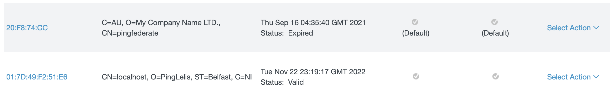

# ping-identity-playground

See [Deploy a simple stack with PingFederate and PingDirectory](https://devops.pingidentity.com/deployment/deployCompose/) for more information.

See [pingone-sample-dotnet](https://github.com/pingidentity/pingone-sample-dotnet) for more information.

## Prerequisites

- You should have a [Ping Identity DevOps Registration](https://devops.pingidentity.com/get-started/devopsRegistration/);

- [.NET 5.0](https://dotnet.microsoft.com/download/)

## Running the `infra` locally

First, you need to replace the credentials in the [docker-compose](docker-compose.yaml) environment to your own (replace in `pingaccess`, `pingfederate` and `pingdirectory`):

```bash
      - PING_IDENTITY_DEVOPS_USER=<your-devops-user-here>
      - PING_IDENTITY_DEVOPS_KEY=<your-devops-key-here>
```

To open the `PingFederate` locally, open the following URL in your browser:

```
https://localhost:9999/pingfederate/app#/
```

When asked for the username and password, enter the following:

```
username: administrator
password: 2FederateM0re
```

To open the `PingAccess` locally, open the following URL in your browser:

```
https://localhost:9000/
```

When asked for the username and password, enter the following:

```
username: administrator
password: 2FederateM0re
```

Finally, to open the `PingDataConsole` (PingData Administrative Console) locally, open the following URL in your browser:

```
https://localhost:8443/
```

When asked for the credentials, enter the following:

```
server: pingdirectory:1636
username: administrator
password: 2FederateM0re   
```

## Creating a new OIDC application

Follow [this stpes](https://docs.pingidentity.com/bundle/solution-guides/page/ywg1598030491145.html) to create a new OIDC application in `PingFederate`.

## Creating a new self-signed certificate

All `PingIdentity` products require https connections, when the `PingFederate` container is running locally, it creates for you a new certificate to secure the `pingfederate` hostname. Running inside the docker network, you'll not face any ssl problems, different from running a client locally pointing to `localhost`. In that case, you need to create a self-signed certificate, for that, follow the steps mentioned in [this article](https://docs.pingidentity.com/bundle/pingfederate-93/page/yij1564002984865.html). It's important to fill the fields `COMMON NAME` and `SUBJECT ALTERNATIVE NAMES` with the `localhost` hostname:



After created, trust that certificate in your local key chain:

[Mac Os](https://tosbourn.com/getting-os-x-to-trust-self-signed-ssl-certificates/)

[Windows](https://superuser.com/questions/370217/trust-ssl-certificate-to-local-system-account)

[Linux](https://unix.stackexchange.com/questions/90450/adding-a-self-signed-certificate-to-the-trusted-list)
